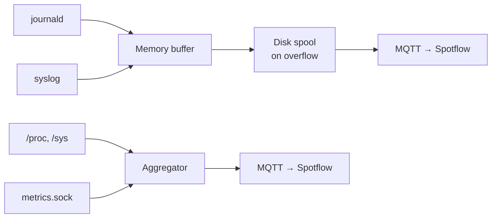

# spotflowd

Linux observability daemon for the [Spotflow](https://spotflow.io) platform.

Collects **logs** (journald, syslog) and **OS metrics** (CPU, memory, disk, network), buffers them locally, and streams them to Spotflow over a persistent MQTT/TLS connection. Local applications can also publish **custom metrics** via a Unix domain socket.

## How it works



- **Memory-first buffer** — log entries are held in RAM (configurable size) to minimise flash writes on embedded targets.
- **Disk spool** — when memory is full, entries are flushed to disk in CBOR chunks. Oldest chunks are dropped when the spool size limit is reached.
- **Publish order** — when connectivity is restored, the newest data is sent first (memory), then older backlog (disk, newest chunk first).
- **Metrics aggregation** — OS and custom samples are collected on a configurable interval and accumulated (sum / count / min / max) before uploading. Aggregation windows: `none`, `1m`, `1h`, `1d`.
- **Custom metrics socket** — any local process can publish application-level metrics via a Unix socket using newline-delimited JSON. No SDK dependency required.
- **Persistent MQTT connection** — single TLS connection to `mqtt.spotflow.io:8883`; reconnects automatically on failure.

## Installation

### Quick install (recommended)

Install the latest pre-built binary with a single command:

```bash
curl -sSfL https://github.com/kucerah0nza/spotflowd/releases/latest/download/install.sh | sudo bash
```

This detects your architecture, downloads the correct binary, creates the `spotflow` system user, installs the systemd service, and drops a starter config at `/etc/spotflow/spotflowd.toml`.

| Flag | Description |
|------|-------------|
| `--syslog-only` | Install the minimal build without journald support |
| `--version 0.1.0` | Install a specific version instead of latest |

Example — install the syslog-only variant:

```bash
curl -sSfL .../install.sh | sudo bash -s -- --syslog-only
```

After installing, edit `/etc/spotflow/spotflowd.toml` and set `device.id` and `device.ingest_key` from your Spotflow dashboard, then start the service:

```bash
sudo systemctl start spotflowd
sudo journalctl -u spotflowd -f
```

---

### Download pre-built binaries

Pre-built binaries are available on the [GitHub Releases](https://github.com/kucerah0nza/spotflowd/releases) page.

| Architecture | Target triple | Default (journald + syslog) | Syslog-only |
|---|---|---|---|
| x86-64 | `x86_64-unknown-linux-gnu` | `spotflowd-*-x86_64-unknown-linux-gnu.tar.gz` | `...-syslog-only.tar.gz` |
| ARM64 | `aarch64-unknown-linux-gnu` | `spotflowd-*-aarch64-unknown-linux-gnu.tar.gz` | `...-syslog-only.tar.gz` |
| ARMv7 | `armv7-unknown-linux-gnueabihf` | `spotflowd-*-armv7-unknown-linux-gnueabihf.tar.gz` | `...-syslog-only.tar.gz` |

Each tarball contains the `spotflowd` binary, `spotflowd.toml.example`, and `spotflowd.service`.

---

### Build from source

<details>
<summary>Click to expand build-from-source instructions</summary>

**1. Install system dependencies**

```bash
sudo apt-get update && sudo apt-get install -y \
  curl build-essential pkg-config libsystemd-dev rsyslog
```

**2. Install Rust**

```bash
curl --proto '=https' --tlsv1.2 -sSf https://sh.rustup.rs | sh -s -- -y
source "$HOME/.cargo/env"
```

**3. Clone and build**

```bash
git clone https://github.com/kucerah0nza/spotflowd.git
cd spotflowd
cargo build --release
sudo cp target/release/spotflowd /usr/sbin/spotflowd
```

**4. Create config file**

```bash
sudo mkdir -p /etc/spotflow
sudo cp config/spotflowd.toml.example /etc/spotflow/spotflowd.toml
sudo nano /etc/spotflow/spotflowd.toml
```

Set `device.id` and `device.ingest_key` to the values from your Spotflow dashboard.

**5. Install and start the systemd service**

```bash
sudo useradd -r -s /bin/false spotflow
sudo mkdir -p /var/lib/spotflow/spool
sudo chown spotflow:spotflow /var/lib/spotflow/spool

# Let the spotflow user read the config (contains the ingest key).
sudo chown spotflow:spotflow /etc/spotflow/spotflowd.toml
sudo chmod 600 /etc/spotflow/spotflowd.toml

sudo cp systemd/spotflowd.service /etc/systemd/system/
sudo systemctl daemon-reload
sudo systemctl enable --now spotflowd
```

**6. Verify it is running**

```bash
sudo systemctl status spotflowd
sudo journalctl -u spotflowd -f
```

You should see `MQTT connected to Spotflow platform` in the logs.

**7. (Optional) Enable log severity in syslog**

By default, rsyslog writes logs without a priority field, so severity cannot be determined and is omitted from the data sent to Spotflow.
To include severity, configure rsyslog to use the traditional format:

```bash
echo '$ActionFileDefaultTemplate RSYSLOG_TraditionalFormat' | sudo tee /etc/rsyslog.d/00-spotflow.conf
sudo systemctl restart rsyslog
```

This switches `/var/log/syslog` to RFC 3164 format (`<PRI>Mmm DD HH:MM:SS ...`), from which `spotflowd` extracts the severity level.

**8. Send a test log entry**

```bash
logger "hello from spotflowd"
logger -p user.err "this is an error"
```

The messages should appear in the Spotflow dashboard within seconds.

</details>

---

### Yocto (embedded Linux)

A ready-made BitBake meta-layer is included at `yocto/meta-spotflow/`.

**1. Add the layer to your build**

```bash
cd poky
source oe-init-build-env

# Copy or symlink the layer into your sources directory
cp -r /path/to/spotflowd/yocto/meta-spotflow ../sources/meta-spotflow

# Register the layer
bitbake-layers add-layer ../sources/meta-spotflow
```

**2. Add spotflowd to your image**

In your `local.conf` or image recipe:

```
IMAGE_INSTALL:append = " spotflowd"
```

**3. Build**

```bash
bitbake your-image
```

**4. Configure the device**

After first boot, edit `/etc/spotflow/spotflowd.toml` and set `device.id` and
`device.ingest_key` to the values from your Spotflow dashboard.

The daemon starts automatically via SysVinit. Manage it with:

```bash
/etc/init.d/spotflowd status
/etc/init.d/spotflowd restart
```

**Systemd-based Yocto images:** If your image includes systemd, enable the
`journald` feature in `local.conf`:

```
PACKAGECONFIG:append:pn-spotflowd = " journald"
```

This builds spotflowd with journald log collection in addition to syslog.

**Note:** The default Yocto config ships with `syslog = true` and
`journald = false`, since most Yocto images use BusyBox syslogd rather than
systemd-journald.

---

### Manual run (testing, no systemd service)

```bash
sudo RUST_LOG=debug spotflowd /etc/spotflow/spotflowd.toml
```

`/var/log/syslog` requires read access — run as root or add your user to the `adm` group:

```bash
sudo usermod -aG adm $USER   # then log out and back in
```

Control the daemon's own log verbosity via `RUST_LOG`:

```bash
RUST_LOG=debug spotflowd       # verbose
RUST_LOG=warn  spotflowd       # quiet
```

## Configuration

Default config path: `/etc/spotflow/spotflowd.toml`

A custom path can be passed as the first CLI argument:

```bash
spotflowd /path/to/config.toml
```

See [`config/spotflowd.toml.example`](config/spotflowd.toml.example) for all options with descriptions.

### Config structure

| Section | Description |
|---|---|
| `[device]` | Device ID and ingest key (**required**) |
| `[mqtt]` | Broker address, port, keep-alive |
| `[logs]` | Log source selection (journald, syslog) |
| `[logs.buffer]` | Memory and disk spool settings |
| `[metrics]` | OS metrics collection toggle, intervals |
| `[metrics.groups]` | Enable / disable individual metric groups |
| `[metrics.disk]` | Mount points to report |
| `[metrics.network]` | Network interfaces to report |
| `[metrics.custom]` | Custom app metrics via Unix socket |

### Minimal config

Only `[device]` is required — all other sections have sensible defaults:

```toml
[device]
id = "my-device-001"
ingest_key = "sk_..."
```

### Enabling metrics

Set `enabled = true` under `[metrics]`:

```toml
[metrics]
enabled = true
collection_interval_secs = 10   # how often to read /proc and /sys
aggregation_interval = "1m"     # upload window: none | 1m | 1h | 1d
```

Metric groups (all enabled by default):

| Group | Metrics |
|---|---|
| `cpu` | `cpu_utilization_percent`, `cpu_load_avg_1m`, `cpu_load_avg_5m`, `cpu_load_avg_15m`, `cpu_temperature` |
| `memory` | `mem_available_bytes`, `mem_used_percent`, `swap_used_percent` |
| `disk` | `disk_free_bytes`, `disk_used_percent`, `disk_inodes_used_percent`, `disk_read_bytes`, `disk_write_bytes`, `disk_read_ops`, `disk_write_ops`, `disk_io_util_percent` |
| `network` | `network_rx_bytes`, `network_tx_bytes`, `net_rx_errors`, `net_tx_errors`, `net_rx_drops`, `net_tx_drops` |
| `system` | `uptime_ms`, `process_count`, `fd_used`, `fd_max` |

Disable a group to reduce traffic on constrained devices:

```toml
[metrics.groups]
disk    = false
network = false
```

### Custom application metrics

Any process on the same machine can publish custom metrics to Spotflow without
depending on this codebase. Enable the socket listener:

```toml
[metrics.custom]
enabled = true
socket_path = "/run/spotflow/metrics.sock"   # default
```

The socket accepts **newline-delimited JSON**. Each line is one metric:

```json
{"name": "queue_depth", "value": 42}
{"name": "job_duration_ms", "value": 183.5, "labels": {"worker": "main"}}
```

Connect, send one or more lines, then close. No response is sent back.

**Shell (one-liner):**
```bash
# -N closes the connection after stdin EOF (required with netcat-openbsd)
echo '{"name":"queue_depth","value":42}' | nc -UN /run/spotflow/metrics.sock
```

**Python:**
```python
import socket, json

def send_metric(name, value, labels=None):
    msg = {"name": name, "value": value}
    if labels:
        msg["labels"] = labels
    with socket.socket(socket.AF_UNIX, socket.SOCK_STREAM) as s:
        s.connect("/run/spotflow/metrics.sock")
        s.sendall(json.dumps(msg).encode() + b"\n")

send_metric("queue_depth", 42)
send_metric("job_duration_ms", 183.5, {"worker": "main"})
```

**C:**
```c
#include <stdio.h>
#include <sys/socket.h>
#include <sys/un.h>
#include <unistd.h>

void send_metric(const char *name, double value) {
    int fd = socket(AF_UNIX, SOCK_STREAM, 0);
    struct sockaddr_un addr = {.sun_family = AF_UNIX};
    snprintf(addr.sun_path, sizeof(addr.sun_path), "/run/spotflow/metrics.sock");
    connect(fd, (struct sockaddr *)&addr, sizeof(addr));
    dprintf(fd, "{\"name\":\"%s\",\"value\":%g}\n", name, value);
    close(fd);
}
```

Custom metrics flow through the same aggregator as OS metrics and respect the
configured `aggregation_interval`. `[metrics.custom]` is independent of
`[metrics] enabled` — custom metrics work without OS metrics enabled.

## Build features

| Feature    | Default | Description                       |
|------------|---------|-----------------------------------|
| `journald` | enabled | Collect logs from systemd journal |

Disable journald (e.g. for Yocto without systemd):

```bash
cargo build --release --no-default-features
```

## License

Business Source License 1.1 — see [LICENSE.MD](LICENSE.MD).
Converts to Apache 2.0 four years after first public release.
Contact [hello@spotflow.io](mailto:hello@spotflow.io) for alternative licensing.
